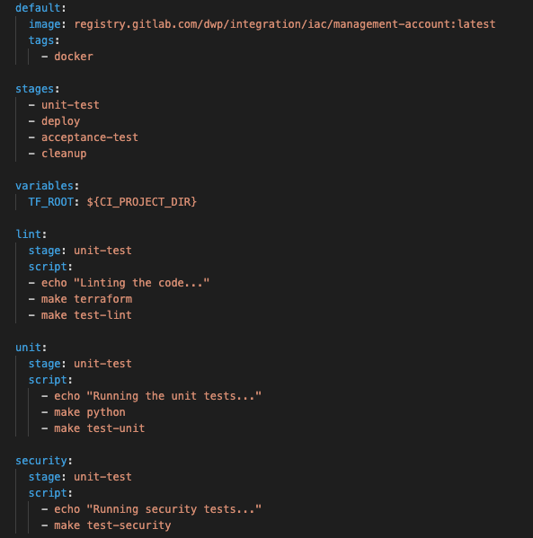
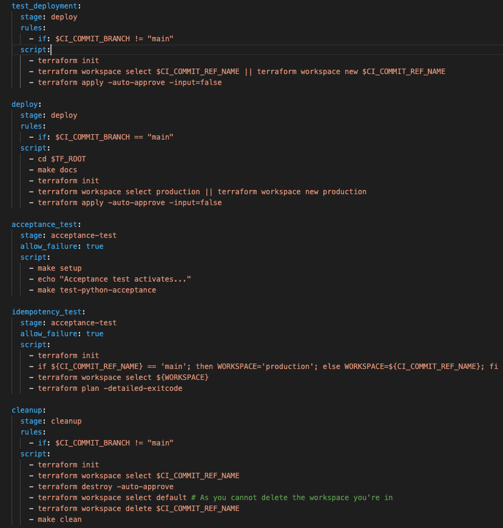

# 13th - 17th of June

This week I finished my work with Adam on creating our CI/CD pipeline. The end result looked like so.

I then worked on ticket IDT-8850 which required me to add a make command to automatically generate our terraform documentation using a tool called terraform docs. This saw the us finish the last tickets assigned to this sprint so I decided to pull a couple small tasks from the backlog, these were to update the make clean command to remove all temp files created during local testing, and to add the aws cli + user credentials to the container image. I added the credentials to the container image by simply adding as step to the make shell command which copys the users ~/.aws/ folder to the CWD, meaning it gets mounted to the container along with the rest of the files, so whoever runs the container will have their own user credentials automatically configured.

## Off the Job

### PluralSight

- Architecting in AWS Skill IQ - 107 Proficient
- Containers on AWS Wavelength
- Serverless Event-based Application Architecture
- Python for Data Analysis - Proficient 103
